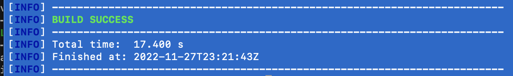
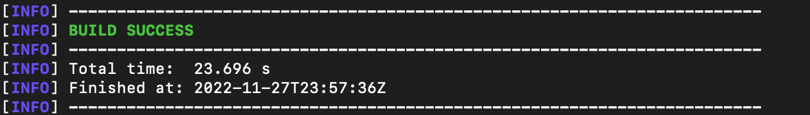
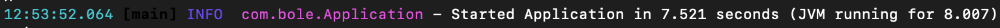
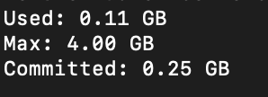

# Java-MicronautInAction-With-GRPC-Scala

Micronaut and Spring-boot in Action
==============================================

## About Micronaut
Micronaut is an open source JVM-based software framework for building lightweight, modular applications and microservices. Micronaut is known for its ability to help developers create apps and microservices with small memory footprints and short startup times.

## About Springboot
Java Spring Boot (Spring Boot) is a tool that makes developing web application and microservices with Spring Framework faster and easier through three core capabilities: Autoconfiguration. An opinionated approach to configuration. The ability to create standalone applications.

## What will you learn with this demo?

- How to Completely replace a Spring-boot Java project with a Micronaut Java project or vice-versa!
- How to Have a multi-module maven structured project with Micronaut in one module and a Scala project in the second module
- How to Create a Rest Controller with Spring-boot annotations and 'Micronaut annotations'
- How to Invoke declaratively a remote rest client with Spring-boot Feign client annotations 
- How to Invoke declaratively a remote rest client With pure Feign client without Spring-boot annotations
- How to Create a grpc server/client which will be used as an Authentication Server to generate a JWTtoken
- How to Communicate with a remote server using an authenticated http1 request
- How to Create a Scala mocked server that will expect an authenticated request
- How to Force a request retry in case your firsts requests didn't succeed
- How to Create integration tests to validate your scenarios with MicronautTest
- How to Do other small but important things (like integrate OpenAPI and document your API), Generate a JWT token, sf4j logs, Json and other annotations

## Where to find both versions of this demo for Micronaut and Spring-boot

- [Micronaut](micronaut/)

- [Springboot](springboot/)

In both cases, the maven command (mvn clean install) should end successfully.

## Where to start?
You can start by looking at the tests scenarios available @ 
- [Micronaut](micronaut/service/src/test/java/com/bole/controller/UserControllerTest.java) (micronaut/service/src/test/java/com/bole/controller/UserControllerTest.java)
- [Springboot](springboot/service/src/test/java/com/bole/controller/UserControllerTest.java) (springboot/service/src/test/java/com/bole/controller/UserControllerTest.java)

## Stats - results
This is a limited test case but from here we can see that:
- Micronaut is faster to run, it only took 17.400 seconds to run (mvn clean install) 
  

- Micronaut is faster to start, it only took 2676ms to lauch the server (mvn mn:run) 
  

- Micronaut did use less memory 
  

## Exceptions/errors you my face and actions to take
1. java.lang.RuntimeException: /packages cannot be represented as URI  
  Action: 
  Switch to Java 11, this one did happen with Java 17, Scala version in use doesn't support it

## Some References

- Micronaut @ https://micronaut.io/
- Micronaut launch @ https://micronaut.io/launch/
- Spring-boot @ https://spring.io/projects/spring-boot
- Spring-boot initializr @ https://start.spring.io/
- Feign Client @ https://github.com/OpenFeign/feign
- Grpc @ https://grpc.io/
- Scala @ https://www.scala-lang.org/
- Scala twitter finagle @ https://twitter.github.io/finagle/
- Scala feature testing @ https://www.scalatest.org/getting_started_with_feature_spec
- Junit 5 jupiter @ https://junit.org/junit5/docs/current/user-guide/
- OpenAPI (Swagger) @ https://swagger.io/specification/
- Json web token @ https://jwt.io/
